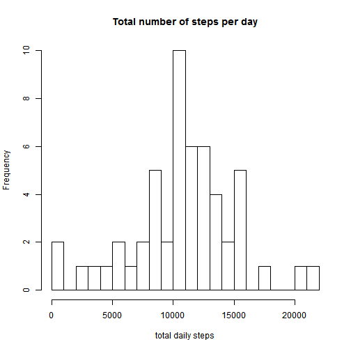

This markdown is designed to analyze the data collected from a personal tracker.
 this tracker logs the number of steps a person takes and puts them down in 5min intervals.

so. let's read the data in first. 
we're assuming that the data is available in your working directory.
it has to be unzipped and read into R studio.


```r
 # raw_data <- read.csv(unz("./data/activity.zip", "activity.csv"))
```


```r
raw_data <- read.csv("activity.csv")
```

oh and lets load these libraries:

```r
library(lattice)
```

## What is the mean total number of steps taken per day?
so first of all, we calculate the sum of all steps taken per day:

```r
sum_steps_day <- aggregate(raw_data$steps, by=list(date=raw_data$date), FUN=sum)
head(sum_steps_day)
```

```
##         date     x
## 1 2012-10-01    NA
## 2 2012-10-02   126
## 3 2012-10-03 11352
## 4 2012-10-04 12116
## 5 2012-10-05 13294
## 6 2012-10-06 15420
```

then, we draw the histogram here.i use a simple histogram

```r
hist(sum_steps_day$x, breaks=20, main="Total number of steps per day", xlab="total daily steps")
```

 

looks good. now we calculate the mean and the median of the total number of steps taken

```r
steps_mean <- mean(sum_steps_day$x, na.rm = TRUE)
steps_median <- median(sum_steps_day$x, na.rm = TRUE)
```
1. The **Mean** of the total number of steps is 1.0766189 &times; 10<sup>4</sup>
2. The **Median** of the total number of steps is 10765

## What is the average daily activity pattern
so it gets more complicated here. we have to filter our time intervals to figure out how many levels 
of change are there. so here we go:

```r
interval_factor <- factor(raw_data$interval)
steps <- nlevels(interval_factor)
interval_factor <- factor(raw_data$interval)[1:steps]

# now for the average steps for each 5 min interval
avg_steps <- tapply(raw_data$steps, factor(raw_data$interval), FUN=mean, na.rm = TRUE)
avg_steps <- sapply(avg_steps, simplify = array, round, 2)

#and the plotting part:
xyplot(as.numeric(avg_steps) ~ raw_data$interval[1:288],
type = "l",
xlab = "5min Intervals",
ylab = "Average # of Steps",
main = "A Time series of average of steps in each interval",
col = "blue"
)
```

 

using the data we have, we sort the time intervals by the average steps to find the max # of steps.

```r
steps_interval <- data.frame(interval_factor, avg_steps)
steps_interval <- steps_interval[order(steps_interval$avg_steps, decreasing = TRUE),]
steps_interval$interval_factor[1]
```

```
## [1] 835
## 288 Levels: 0 5 10 15 20 25 30 35 40 45 50 55 100 105 110 115 120 ... 2355
```

## Imputing missing values(new word. impute!)
the number of missing values are as follows:

```r
length(raw_data$steps[is.na(raw_data$steps)])
```

```
## [1] 2304
```
so for the second part, we make a loop and replace each NA with the average, as suggested in the readme.

```r
steps <- raw_data$steps

for (i in which(sapply(steps, is.na))) {
  if (i <= 288){
    steps[i] <- avg_steps[i]
  }
  
  else{
    j <- i%%288 + 1
    steps[i] <- avg_steps[j]
  }
}

days <- factor(steps)

total_steps <- tapply(steps, days, FUN = sum)

histogram(steps,
          main = "total steps after imputing the NAs")
```

 
